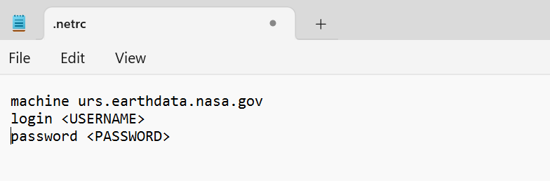
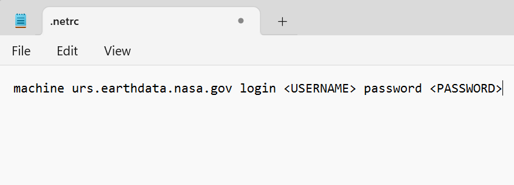

# How to Set up a `.netrc` file for Authentication
There are several ways to set up a `.netrc` file in your home directory.

- ### Manual set up
    Download the [.netrc template file](https://github.com/nasa/LPDAAC-Data-Resources/tree/main/data/.netrc) and save it in your *home/user/* directory, where *user* is your personal user directory. For example: `C:\Users\user\.netrc` or `home/user/.netrc.`  
  - Open the `.netrc` file in a text editor and replace <USERNAME> with your NASA Earthdata Login username and <PASSWORD> with your NASA Earthdata Login password.
  
  After editing, the file should look something like this:
  
  
  
  or you can also have everything on a single line separated by spaces, like:
  
  


- ### Create .netrc file from the Command Line
  
  **For Linux/MacOS:**
  
  To Create a .netrc file, enter the following in the command line, replacing <USERNAME> and <PASSWORD> with your NASA Earthdata username and password. This will create a file in your home directory or append your NASA credentials to an existing file.
  
  ```bash
  echo "machine urs.earthdata.nasa.gov login <USERNAME> password <PASSWORD>" >>~/.netrc
  ```
  
  **For Windows:**
  
  To Create a .netrc file, enter the following in the command line, replacing <USERNAME> and <PASSWORD> with your NASA Earthdata username and password. This will create a file in your home directory or append your NASA credentials to an existing file.
  
  ```cmd
  echo machine urs.earthdata.nasa.gov login <USERNAME> password <PASSWORD> >> %userprofile%\.netrc
  ```
  
  You can verify that the file is correct by opening with a text editor. It should look like an example in one of the figures above.

- ### Programmatically:
    - #### Python
        The [`earthaccess` Python library](https://earthaccess.readthedocs.io/en/latest/) provides a convenient way to authenticate, search, and access NASA Earth science data using Python. It can be used to manage Earthdata Login and generate access tokens.
        Run the code below to create a `.netrc` file in your home directory. You will be prompted to enter your Earthdata Login credentials.
        ```python
        import earthaccess
        earthaccess.login(persist=True)
        ``` 
        Instruction on how to install the `earthaccess` library is provided [here](https://earthaccess.readthedocs.io/en/latest/quick-start/).

    - #### R 
        The [`earthdatalogin` R Package](https://cran.r-project.org/web/packages/earthdatalogin/index.html) provides convenient authentication and access to NASA 'EarthData' products using R. `edl_netrc` function will create a `.netrc` file using your Earthdata Login (EDL) credentials. 
        ```r
        library(earthdatalogin)
        edl_netrc(username = Insert_Your_Username, password = Insert_Your_Password, netrc_path = '~/.netrc')
        ```
        More details can be found [here](https://github.com/boettiger-lab/earthdatalogin/blob/main/R/edl_netrc.R).

