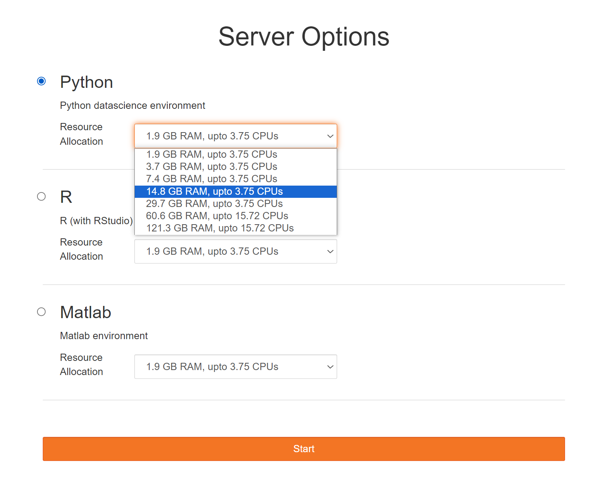
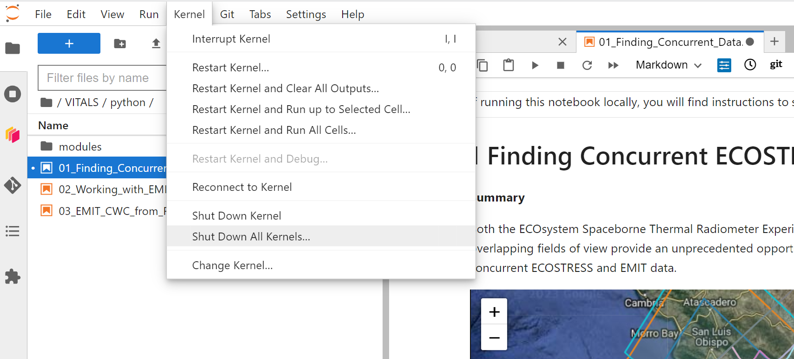

> The **Openscapes 2i2c JupyterHub Cloud Workspace** is a cloud JupyterHub space provided by the LP DAAC for workshop participants. **This cloud space is only available for 2 weeks after the workshop**. Uisng this workspace, there are no additional setup requirements for the Python environment during hands-on activities. All packages needed are included unless specified within a notebook, in which case a cell will be dedicated to installing the necessary Python libraries using the appropriate package manager.

## Prerequisites  

To follow along during the workshop, or to run through the notebooks contained within the repository, the following are required. All software or accounts are free.

1. **Earthdata Login account**  
    - Create an Earthdata Login account (if you don't already have one) at <https://urs.earthdata.nasa.gov/users/new>
    - Remember your username and password; you will need them to download or access data during the workshop and beyond.
2. **Netrc file**
    - This file is needed to access NASA Earthdata assets from a scripting environment like Python.
    - There are multiple methods to create a .netrc file. For this workshop, `earthaccess` package is used to automatically create a netrc file using your Earthdata login credentials if one does not exist. There are detailed instruction available for creating a .netrc file using other methods [here](https://github.com/nasa/LPDAAC-Data-Resources/blob/main/guides/create_netrc_file.md).
3. **Laptop or tablet**
    - Participation in the exercises requires a laptop or tablet. Yes, a tablet works too! All workshop participants will have access to a 2i2c Jupyter Lab instance running in AWS us-west 2.  

We recommmend creating a GitHub account (if you don’t already have one) at <https://github.com/join> to [contribute](../CONTRIBUTING.md) to this repository. Follow optional [advice on choosing your username](https://happygitwithr.com/github-acct.html).  

## Cloud Workspace Access  

Visit [Openscapes 2i2c JupyterHub](https://workshop.openscapes.2i2c.cloud/) and log in using your email as a username and the shared password.

Be sure to select the radio button for **Python** and a size (**14.8 GB RAM and up to 3.75 CPUs)**. Most of the notebooks will work with this size instance unless otherwise specified.

  

## Troubleshooting

We recommend *Shutting down all kernels* after running each notebook. This will clear the memory used by the previous notebook, and is necessary to run some of the more memory intensive notebooks. 

  

No single notebook exceeds roughly the limit using the provided data, but **if you choose to use your own data in the notebook, or have 2 notebooks open and do not shut down the kernel, you may get an out of memory error.**  

If you elect to try this on your own data/ROI, you may need to select a larger server size. This will often happen if you are using the last EMIT scene from an orbit. In some cases those can be almost double the size of a normal scene. Please select the smallest possible. 

## Contact Info  

Email: <LPDAAC@usgs.gov>  
Voice: +1-866-573-3222  
Organization: Land Processes Distributed Active Archive Center (LP DAAC)¹  
Website: <https://www.earthdata.nasa.gov/centers/lp-daac>   

¹Work performed under USGS contract G15PD00467 for NASA contract NNG14HH33I. 